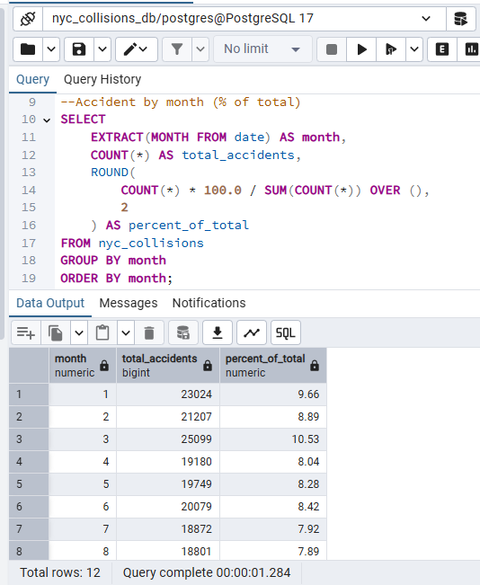
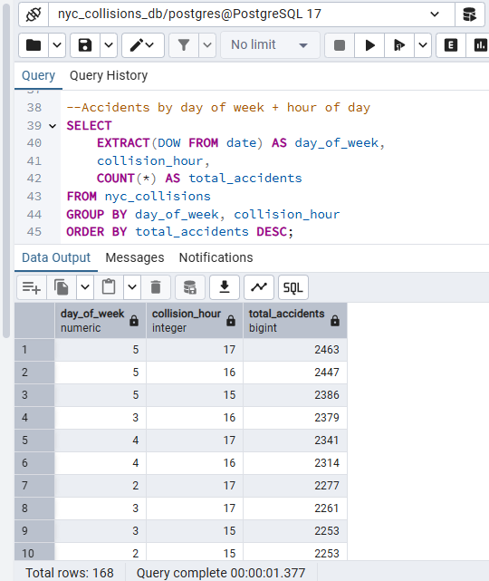
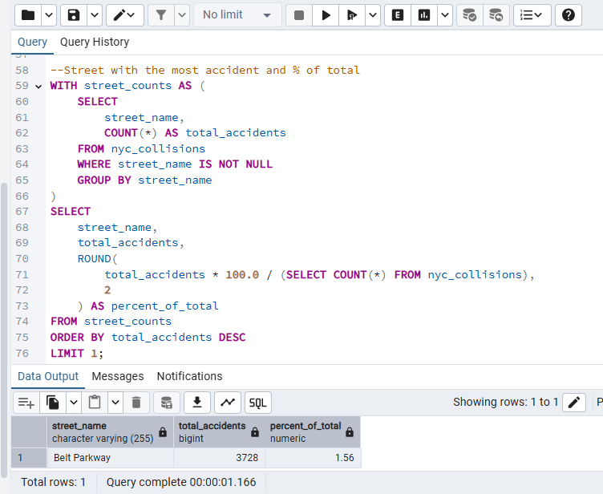
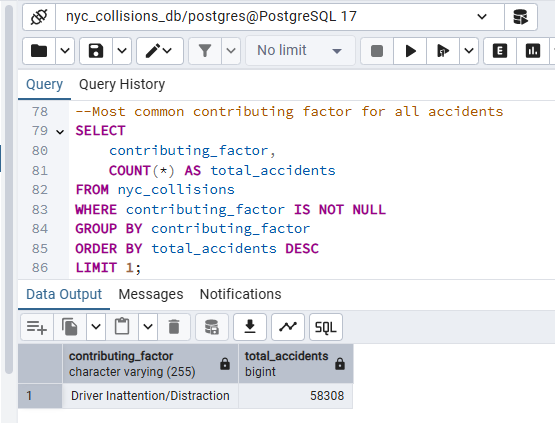
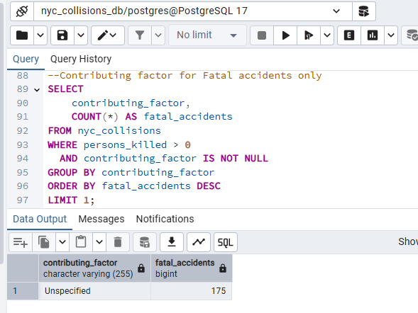
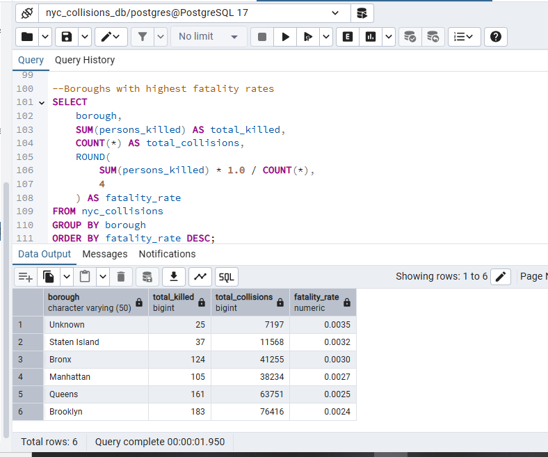
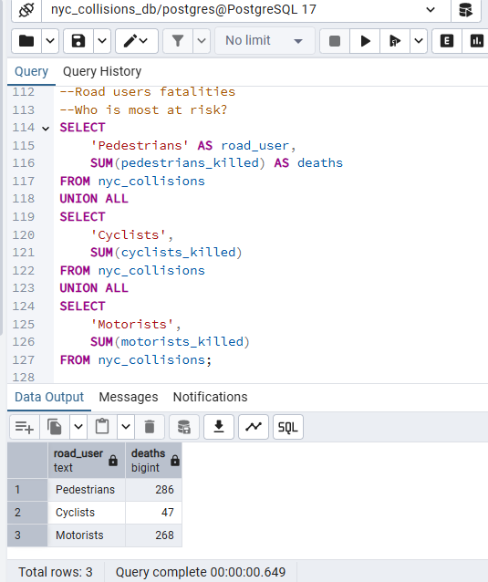

# NYC Traffic Collisions Analysis (SQL | PostgreSQL)

## Problem Statement
New York City experiences thousands of traffic collisions annually, raising concerns around public safety, infrastructure planning and road user protection.  
This project analyzes NYC traffic collision data using **PostgreSQL** to uncover temporal patterns, high risk locations, contributing factors and vulnerable road users, with the goal of identifying data driven safety insights.

---

## Dataset
**Source:** NYC Open Data – Motor Vehicle Collisions recorded by New York Police Department from January-August 2020  
**Records:** [238,421]

**Key Fields:**
- Date & time of collision  
- Borough & street information  
- Injury and fatality counts  
- Contributing factors  
- Road user categories (pedestrians, cyclists, motorists)

---

## Tools Used
- PostgreSQL  
- pgAdmin  
- SQL (CTEs, aggregations, window functions)

---

## Data Cleaning & Preparation
- Standardized missing borough values as `Unknown`
- Handled null injury and fatality counts
- Created helper fields:
  - `collision_hour`
  - `day_of_week`
  - `severity`
- Validated data completeness in key analytical fields

---

## Analytical Questions Answered
1. How do accident rates vary by month, and are there seasonal patterns?
2. When do accidents occur most frequently by day of week and hour?
3. Which streets record the highest number of accidents?
4. What are the most common contributing factors overall and in fatal accidents?
5. Which road users face the highest fatality risk?

---

## Key Insights & Query Outputs

### Monthly Accident Distribution

*Accident distribution shows clear seasonality, with collisions peaking in winter and early spring (January–March) and declining through late summer and fall, suggesting weather-related risk plays a stronger role than traffic volume alone.*

---

### Accidents by Day of Week and Hour

*Collisions occur most frequently during weekday afternoon rush hours (3 PM–6 PM), particularly on Fridays, reflecting the impact of commuter congestion on accident risk.*

---

### Streets with the Highest Accident Counts

*Belt Parkway records the highest number of collisions, accounting for 1.56% of all reported accidents, highlighting elevated risk on high-speed, high-volume corridors.*

---

### Top Contributing Factors (All Accidents)

*Driver Inattention/Distraction is the leading contributing factor, responsible for over 58,000 collisions, indicating that human behavior is the dominant driver of accident risk.*

---

### Contributing Factors in Fatal Accidents

*Fatal accidents are most frequently associated with an “Unspecified” contributing factor, revealing limitations in incident reporting and constraining precise identification of fatality drivers.*

---

### Fatality Rate by Borough

*The highest fatality rate appears under the “Unknown” borough category, reflecting missing location data rather than true geographic risk and highlighting data quality challenges in high severity incidents.*

---

### Road User Fatalities

*Pedestrians account for the highest number of fatalities, followed closely by motorists, indicating that non-protected and high exposure road users face the greatest risk in NYC traffic collisions.*

---

## Recommendations
- Prioritize **winter road safety interventions**, including enforcement and public awareness campaigns during January–March.
- Target **weekday afternoon rush hours** with congestion management and traffic enforcement strategies.
- Improve safety on **high-risk corridors** such as Belt Parkway through speed controls and monitoring.
- Strengthen **distracted driving enforcement and education**, given its dominance as a contributing factor.
- Enhance **fatal crash reporting standards** to reduce reliance on “Unspecified” contributing factors.
- Expand **pedestrian-focused safety measures**, including traffic calming, safer crossings and speed enforcement.

---

## Limitations
- Fatal accident contributing factors are frequently marked as “Unspecified,” limiting causal analysis.
- Borough-level fatality analysis is impacted by missing location data.
- Collision counts do not account for traffic volume or exposure levels, which may influence risk interpretation.

---

## Project Files
- `/sql` – SQL scripts used for data cleaning and analysis  
- `/images` – Query output screenshots  
- `README.md` – Project documentation
